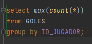
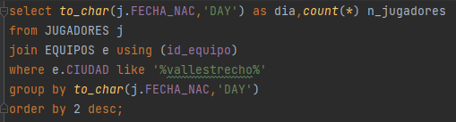
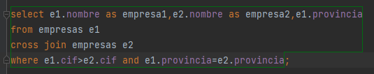
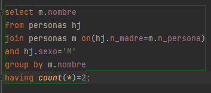
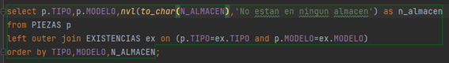

# PORTFOLIO-GBD-MARZO 

### Indice
* [Resumen](#resumen)  
* [Reflexiones personales](#reflexiones-personales)  
* [Ejercicios Significativos](#ejercicios significativos)  
* [Ejercicios de invencion propia](#ejer-propios)  
* [Conclusión](#conclusiones) 

## **_RESUMEN_**
En los temas 6 y 7 estuvimos viendo lo que es considerado como la parte mas importante junto con la creacion de tablas,
esa parte son las **consultas**.
Las consultas es una **tecnica que nos permite visualizar el contenido de una o varias tablas con solo unas lineas**, incluso 
podemos darle formato a esas consultas. En el tema 6 visualizamos un la sintaxis básica de las consultas con un 
`select nomColumna from nomTabla`. Si ponemos `select * from personas` nos sacará todas las columnas e información de la tabla
personas, asi que el asterisco es una de las cosas muy importantes de saber.

Posteriormente, hemos visto los alias que podemos poner a las columnas, se suele poner `as` para establecer el alias pero si lo dejamos sin poner
nos funcionara igualmente. Además de los alias tambien observamos los **operadores condiciones** `<,>,!=,>=,<=`, operadores lógicos `and,or y not`,
la **concatenación de columnas** en una con las tuberias `|| ||`, pero sobre todo la **cláusula que nos permite establecer condiciones 
respecto al select es la llamada `where`**, con ella podemos poner una condición con todos los operadores que hemos visto anteriormente e incluso
muchas cosas como funciones *(between, in, like ...)*. Para ir terminando sobre la sintaxis basica tambien hay que recalcar la parte en la que podemos 
ordenar con la cláusula *`order by nomColumna (desc|asc)`*.

Las **funciones** es otra cosa que hemos visto y que son importantes, **con ellas podemos redondear números, extraer letras de los datos
de una columna, sacar las fechas y darlas formato, etc.** Oracle nos permite convertir textos en números y viceversa, y textos a fechas
y viceversa, para ello se utilizan **_`to_char(),to_number() y to_date()`_**. En la conversión de fechas a textos existen una serie de símbolos
que se utilizan para convertir esa fecha al formato que queramos, lo mismo ocurre con al convertir números en texto. Pero sobre todo lo
mas caracteristico de este tema 6 son las expresiones regulares. Algunas de estas están basadas en otras funciones que solemos utilizar. Las 
expresiones regulares sirven practicamente para realizar consultas de una manera mas sencilla que con funciones normales, es decir, con la funcion
**_`substr`_** se nos puede complicar hacer esa consulta y por ello se utiliza **_`regexp_substr`_**. Antes de terminar tambien se nos permite realizar
condiciones en Oracle y para ello se utilizan **_`case` y `decode`_**,la primera se escoge para hacer condiciones mas complejas que con la segunda
se nos hacen "cuesta arriba".

El tema 7 es mas corto que el 6 pero es igual de importante ya que entran en juego las consultas a varias tablas, para ello se utiliza
`join` sin embargo, esta clausula dispone de 3 variantes **_`join using`,`join on`,`natural join`_**. La primera y la tercera sirven para cruzar tablas
pero solo si la clave primaria de una tabla y la clave foranea de la otra tabla se llaman igual, en cambio el `join on` tambien se puede usar para la
misma funcion que las anteriores, pero ademas para cuando la clave primaria de una tabla y la clave foranea de la otra tabla no se llamen igual. 
Luego estaba el **_`cross join`_** que servía para mostrar todas las combinaciones de todas las filas de la primera
tabla con todas las filas de la segunda tabla. Se usan para consultas algo compejas

Lo ultimo que vimos son las cláusulas **_`group by`_**(sirve para agrupar por cada columna) **_`having`_** (similar al where pero para hacer condiciones con
totales) y  por supuesto las *cláusulas totales* como **_`sum` `avg` `count`_**, etc

## **_REFLEXIONES PERSONALES_**

Personalmente yo ya conocía el tema de las consultas de SQL y me parece algo fascinante pero a la vez complicado de aprender,
no obstante, yo creo que lo positivo que saco de todo esto es que este año he podido aprender a realizar consultas y sobre todo 
entender como funciona el enunciado y poder sacar la consulta correctamente, esto del final es la parte que más hay que practicar ya que si 
no entendemos el enunciado y tampoco sabemos de que va relacionado el propio tema vamos muy mal.
En cuanto a lo negativo me quedo con las veces que he intentado la consulta y finalmente no lo he conseguido, aunque no me salga
por lo menos lo he intentado hacer y he puesto ganas.
En resumen, este tema me ha aportado mucho a la hora de pensar y razonar y que con otras asignaturas o cosas no lo han hecho.

## **_EJERCICIOS SIGNIFICATIVOS_**

### Primer ejercicio(Práctica20-Ejercicio8)
 

Este ejercicio me llamó bastante la atención ya que no sabía que al juntar dos funciones totales como son `count` y `max` pues no se podía efectuar 
una agrupación de 2 columnas. Es bastante sencillo de hacer pero hay que pensar cuales son las funciones a utilizar.

### Segundo ejercicio(Práctica20-Ejercicio6)

A primera vista parece que es sencillo , y lo es pero tiene una pequeña cosa que puede complicarnos, la cuál es que el modo de agrupación se hace en 
función del `to_char(j.fecha_nac,'DAY')`. Yo en un principio lo había agrupado por la fecha de nacimiento normal de un jugador, sin embargo cuando me 
dijeron que había que agruparlo de la otra manera para que la consulta se agrupe por el nombre de la fecha se me encendióm la bombilla, y finalmente 
lo saqué.

### Tercer Ejercicio(Práctica17-Ejercicio15)

Este fue el primer cross join que hice de todos. A partir de ahí todos aquellos ejercicios que requerrían de este tipo de cláusulas me salían bastante bien
porque al conocer como desde el principio como funciona el cross join resultaba algo mas sencillo.

### Cuarto Ejercicio(Práctica19-Ejercicio5)

El ejercicio es fácil pero el modo de relacionar cada una de las tablas de esta base de datos es muy enrevesado, ya que solo existe una única tabla.
Vemos como hay un `join on` en esta consulta para poder sacar las madres, pero es que además nos pide las que tienen dos hijas. Esto último es muy importante
porque a veces no nos fijamos bien del enunciado como me paso a mí con esta consulta y no me dí cuenta de que habia que poner en el sexo de la hija femenino.
Incluso también hay que poner `count` dentro del having (se utiliza para condiciones con totales), para que nos saque las que tienen dos hijas unicamente.
Finalmente conseguí resolver dicho ejercicio poniendo.

### Quinto Ejercicio(Práctica17-Ejercicio14)

La utilización de `left outer join` es algo nuevo a que nosotros en ningún momento habíamos hecho consultas externas, es decir, por ejemplo en este ejercicio
nos muestra todos las piezas relacionadas con existencias y viceversa, pero también aquellas piezas que no tienen existencia en el almacén.
Además del `left outer join` también usamos el nvl para todas las piezas sin existencia , no obstante, como N_ALMACÉN es de tipo `number` tendremos que cambiarle 
a texto para que funcione y nos sustituya el `null` por lo que queramos establecer.

## **_CONCLUSIONES_**

Al principio algunas de las dificultades que tenía era que no entendía lo que se pedía en el enunciado, es decir, me costaba en 
varias de las practicas, otra de ellas era que no sabia como funcionaban la mayoria de las funciones ya que practicamente casi todas
las desconocía por completo y hasta que me familiarizé con todas me costó algo de tiempo. No obstante, de las estas dos, **la dificultad
más *difícil* fue la de los enunciados ya que si no sabemos comprender los enunciados no salen los ejercicios**.

**De esta unidad me llevo muchas cosas buenas** como por ejemplo el **aprender** que son y como hacer las diversas consultas, **las risas** con los 
compañeros al intentar hacerlas y que ademas salgan bien... son tantas cosas que me las llevo para siempre. **Por otro lado**, **cuando no paraba 
de hacer una consulta** que llevaba 30 minutos **y** ademas **no la conseguía resolver, eso me ponía bastante enfadado**, de todo lo que hecho puede 
sin ninguna duda que es lo que menos ha gustado.